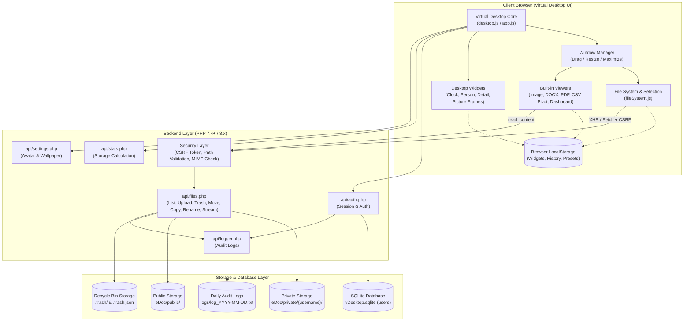
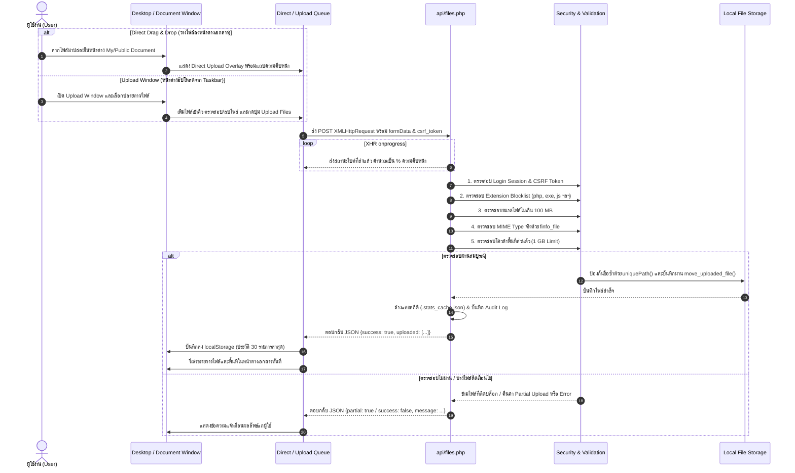
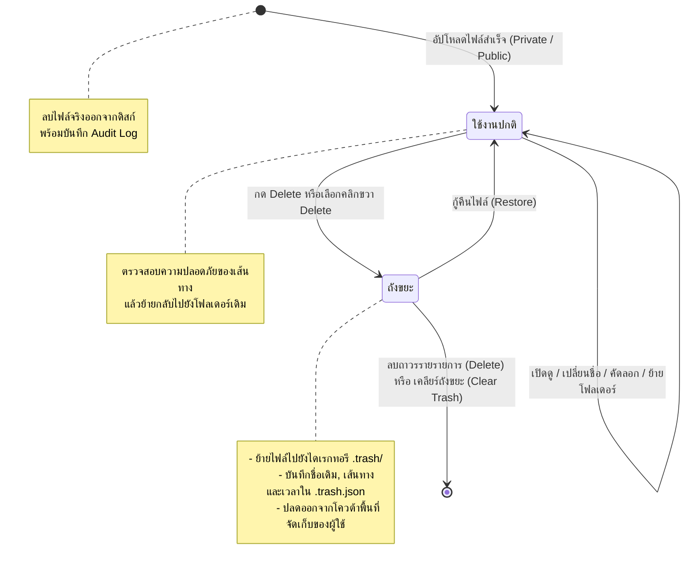
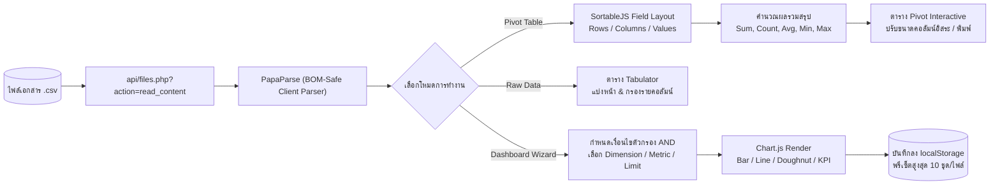

# ระบบจัดการเอกสารอิเล็กทรอนิกส์ (e-Document Virtual Desktop)

[](https://www.php.net/)
[](https://www.sqlite.org/)
[](https://developer.mozilla.org/en-US/docs/Web/JavaScript)
[](https://developer.mozilla.org/en-US/docs/Web/CSS)

ระบบจัดเก็บ บริหารจัดการ และเปิดดูเอกสารอิเล็กทรอนิกส์ในรูปแบบ **Virtual Desktop (เดสก์ท็อปจำลองบนเว็บเบราว์เซอร์)** ครบวงจร ทั้งการจัดการไฟล์ส่วนตัวและส่วนกลาง, การพรีวิวรูปภาพ เอกสาร Word, PDF, ตารางวิเคราะห์ข้อมูล CSV Pivot Table, ระบบแดชบอร์ดกราฟ, ถังขยะรีไซเคิล และวิดเจ็ตปรับแต่งได้ พัฒนาด้วย PHP, SQLite, Vanilla JavaScript และ CSS โดยไม่พึ่งพาเฟรมเวิร์กขนาดใหญ่

---

## สารบัญ

- [แผนภาพการทำงานของระบบ (System Diagrams)](#แผนภาพการทำงานของระบบ-system-diagrams)
  - [1. สถาปัตยกรรมระบบโดยรวม (System Architecture)](#1-สถาปัตยกรรมระบบโดยรวม-system-architecture)
  - [2. ลำดับขั้นตอนการอัปโหลดไฟล์ (File Upload Workflow)](#2-ลำดับขั้นตอนการอัปโหลดไฟล์-file-upload-workflow)
  - [3. วงจรชีวิตไฟล์และการทำงานของถังขยะ (File Lifecycle & Recycle Bin)](#3-วงจรชีวิตไฟล์และการทำงานของถังขยะ-file-lifecycle--recycle-bin)
  - [4. โฟลว์การประมวลผลข้อมูล CSV Pivot & Dashboard](#4-โฟลว์การประมวลผลข้อมูล-csv-pivot--dashboard)
- [ภาพรวมคุณสมบัติเด่น (Features)](#ภาพรวมคุณสมบัติเด่น-features)
  - [เดสก์ท็อปเสมือน (Virtual Desktop)](#เดสก์ท็อปเสมือน-virtual-desktop)
  - [การจัดการไฟล์ (File Management)](#การจัดการไฟล์-file-management)
  - [ระบบอัปโหลดไฟล์แบบละเอียด (Upload System)](#ระบบอัปโหลดไฟล์แบบละเอียด-upload-system)
  - [คีย์ลัดบนแป้นพิมพ์ (Keyboard Shortcuts)](#คีย์ลัดบนแป้นพิมพ์-keyboard-shortcuts)
  - [การค้นหาและไฟล์ล่าสุด (Search & Recent Files)](#การค้นหาและไฟล์ล่าสุด-search--recent-files)
  - [ถังขยะและการกู้คืน (Recycle Bin)](#ถังขยะและการกู้คืน-recycle-bin)
  - [โปรแกรมดูไฟล์ในตัว (Built-in Viewers)](#โปรแกรมดูไฟล์ในตัว-built-in-viewers)
  - [แดชบอร์ดวิเคราะห์ข้อมูล CSV (Dashboard Wizard)](#แดชบอร์ดวิเคราะห์ข้อมูล-csv-dashboard-wizard)
  - [ระบบความปลอดภัย (Security)](#ระบบความปลอดภัย-security)
  - [ระบบบันทึกประวัติการใช้งาน (Audit Logging)](#ระบบบันทึกประวัติการใช้งาน-audit-logging)
- [API Endpoints](#api-endpoints)
- [เทคโนโลยีที่ใช้ (Technology Stack)](#เทคโนโลยีที่ใช้-technology-stack)
- [โครงสร้างโปรเจกต์ (Project Structure)](#โครงสร้างโปรเจกต์-project-structure)
- [โครงสร้างฐานข้อมูล (Database Schema)](#โครงสร้างฐานข้อมูล-database-schema)
- [ขั้นตอนการติดตั้ง (Installation)](#ขั้นตอนการติดตั้ง-installation)
- [การทดสอบระบบ (Testing)](#การทดสอบระบบ-testing)
- [ข้อกำหนดและข้อสังเกตเพิ่มเติม (Notes)](#ข้อกำหนดและข้อสังเกตเพิ่มเติม-notes)

---

## แผนภาพการทำงานของระบบ (System Diagrams)

### 1. สถาปัตยกรรมระบบโดยรวม (System Architecture)

แผนภาพแสดงการเชื่อมต่อระหว่างส่วนแสดงผลบนเบราว์เซอร์ (Client Virtual Desktop), ส่วนประมวลผลเซิร์ฟเวอร์ (PHP API Layer) และส่วนจัดเก็บข้อมูล (Database & Storage Layer):



---

### 2. ลำดับขั้นตอนการอัปโหลดไฟล์ (File Upload Workflow)

แผนภาพแสดงขั้นตอนการทำงานตั้งแต่ผู้ใช้ลากไฟล์หรือเลือกไฟล์ผ่านคิว จนถึงการตรวจสอบความปลอดภัยฝั่งเซิร์ฟเวอร์ และการตอบสนองกลับมายังหน้าจอเดสก์ท็อป:



---

### 3. วงจรชีวิตไฟล์และการทำงานของถังขยะ (File Lifecycle & Recycle Bin)

แผนภาพแสดงสถานะของไฟล์ ตั้งแต่อัปโหลด แก้ไข ย้ายลงถังขยะ กู้คืน และการลบถาวร:



---

### 4. โฟลว์การประมวลผลข้อมูล CSV Pivot & Dashboard

แผนภาพแสดงกระบวนการอ่านและประมวลผลข้อมูลจากไฟล์ CSV สู่การวิเคราะห์ตารางไขว้ (Cross-tab) และแดชบอร์ดกราฟิก:



---

## ภาพรวมคุณสมบัติเด่น (Features)

### เดสก์ท็อปเสมือน (Virtual Desktop)

- **Responsive Desktop:** ไอคอนบนหน้าจอจัดเรียงอัตโนมัติตามขนาดหน้าจอ
- **Taskbar & Start Menu:** แถบงานด้านล่างพร้อมปุ่มลัดไปยังค้นหา (Search), ไฟล์ล่าสุด (Recent Files), ถังขยะ (Recycle Bin), สร้างแดชบอร์ด (Dashboard Wizard), อัปโหลด (Upload), ตั้งค่าโปรไฟล์ (Settings) และออกจากระบบ (Logout)
- **Window Management:** หน้าต่างจำลองรองรับการลากย้ายตำแหน่ง (Drag), ปรับขนาดอิสระ (Resize), ขยายเต็มจอ (Maximize/Restore) และย่อเก็บลง Taskbar
- **Personal Widgets (วิดเจ็ตส่วนตัว):**
  - **Clock Widget:** นาฬิกาบอกเวลาปัจจุบัน
  - **Person Widget:** แสดงรูป Avatar, ชื่อผู้ใช้, จำนวนไฟล์ที่ครอบครอง และพื้นที่ความจุที่ใช้งาน
  - **Detail Widget:** แสดงข้อมูลเมตาของไฟล์ที่กำลังเลือก พร้อมรูปพรีวิวขนาดเล็ก
  - **Picture Frame Widget:** ลากรูปภาพจากหน้าต่างเอกสารมาปล่อยบนเดสก์ท็อป เพื่อตรึงเป็นกรอบรูปภาพ บันทึกตำแหน่งและลำดับใน `localStorage`
- **Settings Window:** เปลี่ยนรูปภาพประจำตัว (Avatar) และภาพพื้นหลังหน้าจอ (Wallpaper)
- **Statistics Window:** สรุปสถิติพื้นที่จัดเก็บส่วนตัว (Private) และพื้นที่ส่วนกลาง (Public)
- **UI Motion System (`css/animations.css`):** แอนิเมชันเปิด/ปิดหน้าต่าง การเปิด Taskbar การจัดเรียงกริดไฟล์ และรองรับ `prefers-reduced-motion` เพื่อความนุ่มนวล
- **High Performance Rendering:** เรนเดอร์ไฟล์ทีละ 150 รายการเพื่อลดภาระ DOM พร้อม in-memory preview cache และตัดการโหลดที่ค้างอยู่เมื่อผู้ใช้เปลี่ยนโฟลเดอร์อย่างรวดเร็ว

---

### การจัดการไฟล์ (File Management)

- **แบ่งแยกพื้นที่จัดเก็บ:** แยกพื้นที่เอกสารส่วนตัว (`My Document` / `eDoc/private/<username>`) และเอกสารส่วนกลาง (`Public Document` / `eDoc/public`)
- **การเลือกไฟล์ (Selection Management):**
  - คลิกเพื่อเลือกไฟล์เดี่ยว
  - กด `Ctrl` หรือ `Cmd` + คลิก เพื่อเลือกหลายไฟล์พร้อมกัน
  - บันทึกสถานะการเลือกแยกตามแต่ละหน้าต่างอย่างอิสระ
  - การเลือกครอบคลุมไฟล์ทั้งหมดในโฟลเดอร์ แม้ไฟล์เหล่านั้นยังไม่ได้เรนเดอร์ลงในหน้าจอ (Progressive Rendering)
- **Progressive Item Rendering:** เมื่อมีไฟล์จำนวนมาก ระบบจะเรนเดอร์ครั้งละ 150 รายการ โดยกดปุ่ม **Show more** เพื่อแสดงผลชุดถัดไป
- **Context Menu (เมนูคลิกขวา):** คลิกขวาที่ไฟล์เพื่อเปิด (Open), เปลี่ยนชื่อ (Rename), คัดลอก (Copy), วาง (Paste), คัดลอกไปยัง (Copy to), ย้าย (Move), ลบ (Delete) และดาวน์โหลดเป็นไฟล์บีบอัด (ZIP Download)
- **การจัดการชื่อไฟล์ซ้ำ:** มีระบบตรวจจับและตั้งชื่อใหม่อัตโนมัติ (`uniquePath`) เช่น `file_1.png` เพื่อป้องกันการเขียนทับโดยไม่ตั้งใจ
- **Secure Preview:** พรีวิวเนื้อหาไฟล์ผ่าน API พิเศษ `api/files.php?action=read_content` โดยต้องล็อกอินและตรวจสอบสิทธิ์ ป้องกันการเข้าถึงไฟล์โดยตรง

---

### ระบบอัปโหลดไฟล์แบบละเอียด (Upload System)

ระบบอัปโหลดของ eDoc ได้รับการออกแบบให้ใช้งานสะดวก มีความยืดหยุ่นสูง และมีความปลอดภัยระดับเซิร์ฟเวอร์:

#### 1. การอัปโหลดแบบ Direct Drag-and-Drop (วางไฟล์ลงหน้าต่างทันที)
- ลากไฟล์จากเครื่องคอมพิวเตอร์มาปล่อยลงบนหน้าต่าง **My Document** หรือ **Public Document** ได้โดยตรง
- มี **Drop Hint Overlay** แสดงโฟลเดอร์ปลายทางที่กำลังจะอัปโหลดแบบเรียลไทม์
- เริ่มอัปโหลดทันทีโดยไม่ต้องเปิดหน้าต่างยืนยันเพิ่มเติม
- แสดง **Direct Upload Overlay** พร้อมแถบเปอร์เซ็นต์ความคืบหน้าแบบเรียลไทม์ (`XMLHttpRequest.upload.onprogress`)
- เมื่ออัปโหลดเสร็จสิ้น ระบบจะรีเฟรชรายการไฟล์และสถิติพื้นที่ในหน้าต่างให้อัตโนมัติ

#### 2. หน้าต่างอัปโหลดเฉพาะ (Upload Window)
- เปิดได้จากไอคอนบน Taskbar
- สามารถเลือกปลายทางจัดเก็บได้: เอกสารส่วนตัว (`My Documents`) หรือเอกสารส่วนกลาง (`Public`)
- มี **Upload Queue (คิวรออัปโหลด):**
  - เพิ่มไฟล์เข้าคิว ตรวจสอบรายชื่อและขนาดไฟล์
  - ลบไฟล์ที่ไม่ต้องการออกจากคิวก่อนเริ่มอัปโหลดได้
  - กดปุ่ม **Upload Files** เพื่อเริ่มกระบวนการ
  - มีแถบ Progress Bar แสดงสถานะการส่งข้อมูล

#### 3. ประวัติการอัปโหลด (Upload History)
- ระบบจะบันทึกประวัติการอัปโหลดไฟล์สำเร็จ **30 รายการล่าสุด** ลงใน `localStorage` ของเบราว์เซอร์ (`edoc.upload-history`)
- บันทึกข้อมูล: ชื่อไฟล์, โฟลเดอร์ปลายทาง, บริบท (ส่วนตัว/ส่วนกลาง) และวันเวลาที่อัปโหลด
- สามารถเปิดดูประวัติย้อนหลังได้จากหน้าต่าง Upload

#### 4. ข้อกำหนดและนโยบายความปลอดภัยการอัปโหลด (Limits & Security)
- **ขนาดไฟล์สูงสุด:** จำกัดไม่เกิน **100 MB ต่อไฟล์** (`$maxUploadFileSize = 100 * 1024 * 1024`)
- **โควต้าพื้นที่ส่วนตัว:** จำกัดไว้ที่ **1 GB** ต่อผู้ใช้งาน (`$storageLimit = 1024 * 1024 * 1024`)
- **บล็อกนามสกุลอันตราย (Extension Blocklist):**
  ไม่อนุญาตให้อัปโหลดหรือเปลี่ยนชื่อเป็นไฟล์: `.php`, `.phtml`, `.phar`, `.exe`, `.bat`, `.cmd`, `.com`, `.scr`, `.msi`, `.js`, `.vbs`, `.ps1`
- **ตรวจสอบ MIME Type ที่ปลอดภัย:** ตรวจสอบเนื้อหาไฟล์จริงผ่าน `finfo_file` โดยบล็อกประเภท `application/x-php`, `application/x-msdownload`, `application/x-msdos-program`
- **รองรับ Partial Upload:** หากอัปโหลดหลายไฟล์พร้อมกันแล้วมีบางไฟล์ถูกปฏิเสธ (เช่น ไฟล์ใหญ่เกินหรือติดบล็อก) ไฟล์ที่ถูกต้องจะยังอัปโหลดสำเร็จ พร้อมข้อความแจ้งเตือนสรุปจำนวนไฟล์ที่ผ่านและถูกข้าม

---

### คีย์ลัดบนแป้นพิมพ์ (Keyboard Shortcuts)

ใช้งานเมื่อคลิกโฟกัสที่หน้าต่าง My Document หรือ Public Document:

| คีย์ลัด | การทำงาน |
| --- | --- |
| `Ctrl + A` / `Cmd + A` | เลือกไฟล์และโฟลเดอร์ทั้งหมดในโฟลเดอร์ปัจจุบัน (รวมถึงรายการที่ยังไม่ได้เรนเดอร์) |
| `Ctrl + C` / `Cmd + C` | คัดลอกไฟล์ที่เลือกเข้าสู่คลิปบอร์ดของระบบ eDoc |
| `Ctrl + V` / `Cmd + V` | วางไฟล์ลงในโฟลเดอร์ปัจจุบัน (สามารถวางข้ามระหว่างส่วนตัวและส่วนกลางได้) |
| `F2` | เปลี่ยนชื่อไฟล์/โฟลเดอร์ที่เลือก (ทำงานเมื่อเลือกไฟล์เพียง 1 รายการ) |
| `Delete` | ลบไฟล์ที่เลือกลงในถังขยะ Recycle Bin (เฉพาะโฟลเดอร์ My Document) |
| `Backspace` | ย้อนกลับขึ้นไปยังโฟลเดอร์แม่ (Parent Directory) |

---

### การค้นหาและไฟล์ล่าสุด (Search & Recent Files)

- **Search Window:** ค้นหาไฟล์ทั้งในส่วนตัวและส่วนกลาง สามารถกรองบริบทโฟลเดอร์ เรียงลำดับตามชื่อหรือขนาด และมีไฮไลท์คำค้นหาในผลลัพธ์
- **Recent Files:**
  - แสดง **25 รายการไฟล์ที่มีการแก้ไขล่าสุด** จากทั้งพื้นที่ส่วนตัวและส่วนกลาง
  - เรียงตามเวลา `modTime` (ใหม่สุดขึ้นก่อน)
  - ไม่รวมไฟล์ในถังขยะและไฟล์แคชระบบ
  - ดับเบิลคลิกเพื่อเปิดดูไฟล์หรือกระโดดไปยังโฟลเดอร์ที่ไฟล์นั้นอยู่ได้ทันที

---

### ถังขยะและการกู้คืน (Recycle Bin)

- ไฟล์ที่ถูกสั่งลบจะถูกย้ายไปยังโฟลเดอร์ซ่อน `.trash` พร้อมบันทึกประวัติใน `.trash.json` เพื่อป้องกันการสูญหายโดยไม่ตั้งใจ
- หน้าต่าง **Recycle Bin** บน Taskbar ใช้สำหรับจัดการไฟล์ในถังขยะ
- รองรับการกู้คืนไฟล์กลับตำแหน่งเดิมรายรายการ (**Restore**)
- ลบถาวรรายรายการ (**Permanently Delete**) ด้วยปุ่ม `Del`
- ฟังก์ชัน **Clear Trash:** ลบไฟล์ในถังขยะส่วนตัวทั้งหมดแบบถาวรในครั้งเดียว
- ตรวจสอบความถูกต้องของเส้นทางกู้คืนไฟล์ฝั่งเซิร์ฟเวอร์ ป้องกัน Path Traversal
- ไฟล์ที่อยู่ในถังขยะจะไม่ถูกนำมาคำนวณในโควต้าพื้นที่การใช้งานของผู้ใช้

---

### โปรแกรมดูไฟล์ในตัว (Built-in Viewers)

#### 1. Image Viewer (โปรแกรมดูรูปภาพ)
- รองรับนามสกุล: `.jpg`, `.jpeg`, `.png`, `.gif`, `.webp`
- ซูมเข้า (Zoom In), ซูมออก (Zoom Out), ปรับพอดีหน้าต่าง (Fit to Window)
- หมุนภาพซ้าย/ขวา (Rotate 90°)
- ครอปรูปภาพ (Crop Tool) รองรับการคำนวณสัดส่วนแบบ `object-fit: contain`
- สามารถตัดรูปและดาวน์โหลดผลลัพธ์ที่ครอปได้ทันที

#### 2. Word Viewer (โปรแกรมเปิดเอกสาร DOCX)
- รองรับไฟล์เอกสาร `.docx` (ไม่รองรับไฟล์รุ่นเก่า `.doc`)
- เรนเดอร์เอกสารออฟไลน์ด้วย **docx-preview.js** (เก็บใน `assets/vendor/`)
- มีปุ่มดาวน์โหลดเอกสารต้นฉบับจาก Toolbar
- แสดงข้อความเตือนให้บันทึกเป็น `.docx` หากพบไฟล์ `.doc` รุ่นเก่า

#### 3. PDF Viewer (โปรแกรมเปิดเอกสาร PDF)
- เปิดอ่านไฟล์ `.pdf` ผ่าน **pdf.js** (เก็บใน `assets/vendor/` ไม่ต้องต่ออินเทอร์เน็ต)
- ควบคุมหน้าเอกสาร (ถัดไป/ก่อนหน้า), ซูมขยาย, ปรับขนาดความกว้าง และปุ่มดาวน์โหลด

#### 4. CSV Pivot & Raw Data Viewer (โปรแกรมวิเคราะห์ข้อมูล CSV)
ดับเบิลคลิกไฟล์ `.csv` เพื่อเปิดหน้าต่างวิเคราะห์ข้อมูลขนาด 1024×760 พิกเซล:
- **แท็บ Pivot Table:**
  - ลากและวางคอลัมน์ (Drag-and-Drop) ด้วย **SortableJS**
  - กำหนดฟิลด์ในแถว (Rows), คอลัมน์ (Columns) และค่าสรุปผล (Values)
  - เลือกฟังก์ชันการคำนวณ: ผลรวม (Sum), จำนวนนับ (Count), ค่าเฉลี่ย (Avg), ค่าน้อยสุด (Min), ค่ามากสุด (Max)
  - มีฟิลด์เสมือน `Row Count` สำหรับนับจำนวนแถว
  - ปรับความกว้างคอลัมน์ได้อิสระ ดับเบิลคลิกที่ขอบคอลัมน์เพื่อ Auto-fit
  - สั่งพิมพ์ (Print) ตาราง Pivot ได้โดยตรง
- **แท็บ Raw Data:**
  - แสดงตารางข้อมูลดิบด้วย Tabulator พร้อมแบ่งหน้า (20, 50, 100, 200 แถว)
  - ตัวกรองข้อมูลแยกตามแต่ละคอลัมน์ (Header Filter) ค้นหาได้อย่างรวดเร็ว

---

### แดชบอร์ดวิเคราะห์ข้อมูล CSV (Dashboard Wizard)

ระบบตัวช่วยสร้างแดชบอร์ดสรุปสถิติจากไฟล์ CSV ใน 3 ขั้นตอน:
1. **เลือกไฟล์ CSV (Select CSV):** เลือกจากเอกสารส่วนตัวหรือส่วนกลาง
2. **ออกแบบกราฟ (Design Chart):**
   - กำหนดเงื่อนไขตัวกรองข้อมูล (Filter AND conditions) ก่อนประมวลผล
   - เลือกมิติข้อมูล (Dimension), ตัวชี้วัด (Metric), วิธีคำนวณ และจำกัด Top N
   - เลือกรูปแบบกราฟ: กราฟแท่ง (Bar), กราฟเส้น (Line), กราฟโดนัท (Doughnut), การ์ดตัวเลข (KPI Card) หรือ ตารางสรุป (Table)
3. **จัดเก็บและแสดงผล (Dashboard):**
   - บันทึกการตั้งค่ากราฟเป็นวิดเจ็ตลงใน `localStorage`
   - สามารถบันทึกชุดแดชบอร์ดล่วงหน้าได้สูงสุด 10 รูปแบบ (Presets) ต่อไฟล์ CSV

---

### ระบบความปลอดภัย (Security)

- **CSRF Protection:** คำขอ POST ทั้งหมดที่แก้ไขข้อมูล (`api/files.php`, `api/settings.php`) ต้องแนบ `csrf_token` ที่ผูกกับเซสชันเสมอ
- **XSS Hardening:** ป้องกันการโจมตีผ่านชื่อไฟล์ด้วยการใช้ `textContent` และฟังก์ชัน `escapeHtml()` แทน `innerHTML`
- **Path Traversal Protection:** ตรวจสอบและทำความสะอาดเส้นทางโฟลเดอร์ผ่าน `cleanRelPath()` และ `safePath()` ป้องกันการเข้าถึงไฟล์นอกเหนือจากไดเรกทอรีที่ได้รับอนุญาต
- **File Type & MIME Validation:** นโยบายตรวจสอบนามสกุลไฟล์และ MIME Type ป้องกันการอัปโหลดสคริปต์อันตราย
- **Session Authentication:** ตรวจสอบการเข้าสู่ระบบในทุก API ป้องกันผู้ไม่หวังดีเข้าถึงข้อมูล

---

### ระบบบันทึกประวัติการใช้งาน (Audit Logging)

- บันทึกกิจกรรมระบบรายวันลงในไดเรกทอรี `logs/log_YYYY-MM-DD.txt`
- บันทึกเหตุการณ์สำคัญ: เข้าสู่ระบบ (Login), ออกจากระบบ (Logout), อัปโหลด (Upload), ลบ (Delete), กู้คืน (Restore), ลบถาวร (Permanent Delete), เคลียร์ถังขยะ (Clear Trash), ย้าย (Move), คัดลอก (Copy), เปลี่ยนชื่อ (Rename) และดาวน์โหลด (Download)
- มีโปรแกรม **Visual Log Viewer** (`logview.php`) สำหรับเปิดดูประวัติเหตุการณ์ย้อนหลังพร้อมตัวกรองและแอนิเมชัน

---

## API Endpoints

### 1. ระบบยืนยันตัวตน: `api/auth.php`

| Action | Method | พารามิเตอร์ | คำอธิบาย |
| --- | --- | --- | --- |
| `register` | POST | `username`, `password` | สมัครสมาชิกใหม่และสร้างไดเรกทอรีส่วนตัว |
| `login` | POST | `username`, `password` | เข้าสู่ระบบและสร้าง Session |
| `logout` | POST | ไม่มี | ออกจากระบบและทำลาย Session |

### 2. ระบบจัดการไฟล์: `api/files.php`

*หมายเหตุ: คำขอแบบ **POST** ทั้งหมดจำเป็นต้องแนบ `csrf_token` เสมอ*

| Action | Method | พารามิเตอร์ | คำอธิบาย |
| --- | --- | --- | --- |
| `list` | GET | `type`, `path` | แสดงรายการไฟล์และโฟลเดอร์ (`type`: `private` หรือ `public`) |
| `upload` | POST | `files[]`, `type`, `path`, `csrf_token` | อัปโหลดไฟล์ ตรวจสอบนามสกุล ขนาด และ MIME type |
| `delete` | POST | `path`, `context`, `csrf_token` | ย้ายไฟล์/โฟลเดอร์ไปยังถังขยะ `.trash` |
| `trash_list` | GET | `context` | ดึงรายการไฟล์ในถังขยะ |
| `trash_restore`| POST | `id`, `context`, `csrf_token` | กู้คืนไฟล์จากถังขยะกลับที่เดิม |
| `trash_delete` | POST | `id`, `context`, `csrf_token` | ลบไฟล์ในถังขยะทิ้งถาวร |
| `trash_clear`  | POST | `context` (private เท่านั้น), `csrf_token` | ลบไฟล์ทั้งหมดในถังขยะส่วนตัวทิ้งถาวร |
| `move` | POST | `src`, `dest`, `csrf_token` | ย้ายตำแหน่งไฟล์/โฟลเดอร์ |
| `copy` | POST | `src`, `dest`, `csrf_token` | คัดลอกไฟล์/โฟลเดอร์ |
| `rename` | POST | `path`, `newName`, `context`, `csrf_token` | เปลี่ยนชื่อไฟล์/โฟลเดอร์ในตำแหน่งเดิม |
| `read_content` | GET | `type`, `path` | ส่งสตรีมเนื้อหาไฟล์เพื่อพรีวิว (เฉพาะประเภทไฟล์ที่อนุญาต) |
| `download_zip` | POST | `paths[]`, `context`, `csrf_token` | บีบอัดรายการไฟล์ที่เลือกและดาวน์โหลดเป็น ZIP |
| `csv_list` | GET | ไม่มี | ดึงรายชื่อไฟล์ CSV ทั้งหมดที่มีในระบบ |
| `recent` | GET | ไม่มี | แสดงรายการ 25 ไฟล์ที่มีการแก้ไขล่าสุด |

### 3. ระบบสถิติ: `api/stats.php`

| Method | คำอธิบาย |
| --- | --- |
| GET | ดึงข้อมูลโปรไฟล์ผู้ใช้, สถิติพื้นที่ส่วนตัว และสถิติพื้นที่ส่วนกลาง |

### 4. ระบบตั้งค่า: `api/settings.php`

| Action | Method | คำอธิบาย |
| --- | --- | --- |
| Avatar Upload | POST | อัปโหลดรูปภาพประจำตัวผู้ใช้ (`csrf_token`) |
| Wallpaper Upload | POST | อัปโหลดรูปภาพพื้นหลังเดสก์ท็อป (`csrf_token`) |

---

## เทคโนโลยีที่ใช้ (Technology Stack)

- **Backend:** PHP 7.4+ หรือ PHP 8.x
- **Database:** SQLite3 (`database/vDesktop.sqlite`)
- **Frontend Core:** HTML5, Vanilla CSS3, Vanilla JavaScript (ES6+)
- **ไลบรารีภายนอก:**
  - [FontAwesome](https://fontawesome.com/) (CDN) — ไอคอนระบบ
  - [PapaParse](https://www.papaparse.com/) (CDN) — ตัวแยกวิเคราะห์ข้อมูล CSV
  - [Tabulator](https://tabulator.info/) (CDN) — ตารางแสดงผลข้อมูลขั้นสูง
  - [Chart.js](https://www.chartjs.org/) (CDN) — เรนเดอร์กราฟสถิติ
  - [SortableJS](https://sortablejs.github.io/Sortable/) (CDN) — ระบบ Drag-and-Drop ฟิลด์ตาราง Pivot
  - [docx-preview](https://github.com/Volune/docx-preview) & [JSZip](https://stuk.github.io/jszip/) (Offline ใน `assets/vendor/`) — พรีวิวไฟล์ Word
  - [pdf.js](https://mozilla.github.io/pdf.js/) (Offline ใน `assets/vendor/`) — พรีวิวไฟล์ PDF

---

## โครงสร้างโปรเจกต์ (Project Structure)

```text
eDoc/
├── api/
│   ├── auth.php              # การยืนยันตัวตน (สมัครสมาชิก, เข้าสู่ระบบ, ออกจากระบบ)
│   ├── csrf.php              # ฟังก์ชันตรวจสอบและออก Token CSRF
│   ├── db.php                # การเชื่อมต่อฐานข้อมูล SQLite
│   ├── files.php             # จัดการไฟล์ (แสดงรายการ, อัปโหลด, ลบ, ย้าย, คัดลอก, ถังขยะ)
│   ├── get_logs.php          # ดึงข้อมูลบันทึกประวัติการใช้งาน
│   ├── logger.php            # ฟังก์ชันเขียนบันทึกประวัติลงไฟล์ประจำวัน
│   ├── response.php          # ตัวช่วยส่งออกผลลัพธ์ JSON มาตรฐาน
│   ├── search.php            # ค้นหาไฟล์ทั้งระบบ
│   ├── settings.php          # ตั้งค่ารูปโปรไฟล์และภาพพื้นหลัง
│   └── stats.php             # คำนวณขนาดความจุและสถิติการใช้งาน
├── assets/
│   └── vendor/               # ไลบรารีสำหรับพรีวิวเอกสารแบบออฟไลน์
│       ├── docx-preview.min.js
│       ├── jszip.min.js
│       ├── pdf.min.js
│       └── pdf.worker.min.js
├── css/
│   ├── animations.css        # แอนิเมชันหน้าต่างและทรานซิชัน UI
│   ├── csvPivot.css          # รูปแบบหน้าต่างและตาราง CSV Pivot
│   ├── dashboardWizard.css   # รูปแบบหน้าต่างตัวช่วยสร้างแดชบอร์ด
│   ├── desktop.css           # สไตล์หน้าจอเดสก์ท็อป ไอคอน และ Taskbar
│   ├── fileSystem.css        # สไตล์ตัวจัดการไฟล์ กริดไฟล์ และการลากวาง
│   ├── logview.css           # สไตล์หน้าแสดง Log Replay
│   ├── main.css              # สไตล์หลักและหน้าล็อกอิน
│   └── window.css            # กรอบหน้าต่าง การลากย้าย และการปรับขนาด
├── database/
│   └── vDesktop.sqlite       # ฐานข้อมูล SQLite จัดเก็บข้อมูลผู้ใช้
├── eDoc/
│   ├── private/              # พื้นที่จัดเก็บไฟล์ส่วนตัวแยกตามผู้ใช้งาน
│   └── public/               # พื้นที่จัดเก็บไฟล์ส่วนกลาง
├── js/
│   ├── app.js                # จัดการเริ่มต้นแอปพลิเคชันและตั้งค่าระบบ
│   ├── auth.js               # จัดการฟอร์มเข้าสู่ระบบและสมัครสมาชิก
│   ├── csvPivot.js           # ตรรกะการประมวลผลตาราง Pivot Table
│   ├── csvViewer.js          # ตัวควบคุมหน้าต่าง CSV Viewer
│   ├── dashboardWizard.js    # ตรรกะตัวช่วยสร้างกราฟและแดชบอร์ด
│   ├── desktop.js            # ตัวควบคุมไอคอนบนหน้าจอเดสก์ท็อปและ Taskbar
│   ├── documentViewers.js    # ตัวพรีวิวเอกสาร DOCX และ PDF
│   ├── fileSystem.js         # ตัวจัดการไฟล์ ระบบเลือก คีย์ลัด และการอัปโหลด
│   ├── imageViewer.js        # ตัวดูรูปภาพ ซูม หมุน และตัดภาพ (Crop)
│   ├── logview.js            # ตรรกะแสดงผล Log Replay
│   ├── searchWindow.js       # ตัวควบคุมหน้าต่างค้นหาไฟล์
│   ├── trashWindow.js        # ตัวควบคุมหน้าต่างถังขยะ
│   ├── uiHelpers.js          # ตัวช่วยฝั่ง UI (การแจ้งเตือน, Dialogs)
│   ├── widgets.js            # จัดการวิดเจ็ตบนเดสก์ท็อป
│   └── windowManager.js      # ตัวควบคุมหน้าต่างจำลอง (เปิด, ปิด, ลาก, ย่อ, ขยาย)
├── logs/                     # ไดเรกทอรีเก็บไฟล์บันทึกประวัติการใช้งาน
├── tests/
│   └── file-selection.cjs    # ชุดทดสอบ Regression สำหรับการเลือกไฟล์จำนวนมาก
├── check_config.php          # สคริปต์ตรวจสอบความพร้อมของเซิร์ฟเวอร์
├── index.php                 # ทางเข้าหลักของระบบ (Single Page Desktop Interface)
├── logview.php               # หน้าต่างดูประวัติระบบ (Audit Log Viewer)
└── TESTING.md                # คู่มือการทดสอบระบบแบบ Manual และ Automated
```

---

## โครงสร้างฐานข้อมูล (Database Schema)

ฐานข้อมูล SQLite จัดเก็บในไฟล์ `database/vDesktop.sqlite`:

### ตาราง: `users`

| ฟิลด์ | ชนิดข้อมูล | คุณสมบัติ | คำอธิบาย |
| --- | --- | --- | --- |
| `id` | INTEGER | PRIMARY KEY AUTOINCREMENT | รหัสประจำตัวผู้ใช้ |
| `username` | TEXT | UNIQUE, NOT NULL | ชื่อผู้ใช้งาน |
| `password` | TEXT | NOT NULL | รหัสผ่านที่เข้ารหัสด้วย `password_hash()` |
| `created_at` | DATETIME | DEFAULT CURRENT_TIMESTAMP | วันที่และเวลาที่สร้างบัญชี |
| `lastlogin` | DATETIME | NULLABLE | วันที่และเวลาที่เข้าสู่ระบบล่าสุด |
| `ipaddress` | TEXT | NULLABLE | ที่อยู่ IP ล่าสุดที่เข้าสู่ระบบ |

---

## ขั้นตอนการติดตั้ง (Installation)

1. คัดลอกโปรเจกต์ไปยังไดเรกทอรีรากของเว็บเซิร์ฟเวอร์ PHP เช่น `htdocs`, `www` หรือคอนฟิก Virtual Host
2. ตรวจสอบว่า PHP ได้เปิดใช้งาน Extension ต่อไปนี้แล้ว:
   - `pdo_sqlite` และ `sqlite3`
   - `fileinfo` (สำหรับตรวจสอบ MIME type ของไฟล์อัปโหลด)
   - `gd` หรือ `imagick` (สำหรับจัดการรูปภาพ)
   - `zip` (สำหรับฟังก์ชันดาวน์โหลด ZIP)
3. ตรวจสอบสิทธิ์การเขียนไฟล์ (Write Permission) บนไดเรกทอรี:
   - `database/`
   - `eDoc/private/`
   - `eDoc/public/`
   - `logs/`
4. เปิดเบราว์เซอร์ไปที่ `http://localhost/eDoc/check_config.php` เพื่อตรวจสอบความพร้อมของสภาพแวดล้อมระบบและสิทธิ์ของไฟล์
5. เข้าใช้งานระบบที่ `http://localhost/eDoc/index.php`
6. ทำการลงทะเบียนผู้ใช้ใหม่ (Register) และเข้าสู่ระบบใช้งาน Virtual Desktop ได้ทันที

---

## การทดสอบระบบ (Testing)

### การทดสอบ Regression ตรรกะการเลือกไฟล์ (Automated Test)

รันคำสั่งทดสอบด้วย Node.js จากโฟลเดอร์หลักของโปรเจกต์:

```bash
node tests/file-selection.cjs
```

ชุดทดสอบนี้จะจำลองสถานการณ์ที่มีไฟล์จำนวน 10,000 รายการ โดยเรนเดอร์ใน DOM 150 รายการ เพื่อตรวจสอบ:
- การเลือกทั้งหมด (`Select All`)
- การคัดลอกไฟล์ที่ถูกเลือกทั้งหมด
- การยกเลิกการเลือกและการสลับสถานะ
- การป้องกันการเปลี่ยนชื่อเมื่อเลือกมากกว่าหนึ่งรายการ
- การแยกสถานะการเลือกไฟล์ระหว่างหน้าต่างให้เป็นอิสระต่อกัน

สำหรับแนวทางการทดสอบการทำงานผ่านหน้าเว็บเบราว์เซอร์ สามารถดูเพิ่มเติมได้ที่ [TESTING.md](TESTING.md)

---

## ข้อกำหนดและข้อสังเกตเพิ่มเติม (Notes)

- **ไดเรกทอรีขณะทำงาน:** ไดเรกทอรี `eDoc/private/`, `eDoc/public/`, โฟลเดอร์ `.trash/`, แคชสถิติ `.stats_cache.json` และไดเรกทอรี `logs/` จะถูกสร้างหรืออัปเดตอัตโนมัติตามการใช้งานของระบบ
- **การลบถาวร:** การลบไฟล์ในถังขยะและการกดล้างถังขยะ (Clear Trash) เป็นการลบข้อมูลออกจากเซิร์ฟเวอร์อย่างถาวร ไม่สามารถกู้คืนได้
- **การครอปรูปภาพ:** การครอปรูปภาพใน Image Viewer จะมีผลเฉพาะภาพพรีวิวและการดาวน์โหลดเท่านั้น ไม่ได้เขียนทับไฟล์ต้นฉบับบนเซิร์ฟเวอร์
- **การอัปเดตหน้าต่างอัตโนมัติ:** เมื่อลากไฟล์วางบนหน้าต่าง My Document หรือ Public Document สำเร็จ ระบบจะรีเฟรชรายการไฟล์ทันที
- **การใช้งานคลิปบอร์ด:** ระบบคัดลอก/วาง (`Ctrl+C` / `Ctrl+V`) ใช้คลิปบอร์ดภายในตัวแอปพลิเคชัน (In-app Clipboard) แยกต่างหากจากคลิปบอร์ดของระบบปฏิบัติการ
- **การจัดเก็บข้อมูล LocalStorage:**
  - กรอบรูปภาพหน้าจอ: จัดเก็บในคีย์ `edoc-picture-frames`
  - ประวัติการอัปโหลด 30 รายการล่าสุด: จัดเก็บในคีย์ `edoc.upload-history`
  - วิดเจ็ตแดชบอร์ด CSV: จัดเก็บในคีย์ `edoc.dashboard.{context}.{path}`
  - ความกว้างคอลัมน์ของตาราง Pivot จะคงอยู่ตลอดช่วงเวลาที่เปิดหน้าต่างนั้น
